<div align="center">

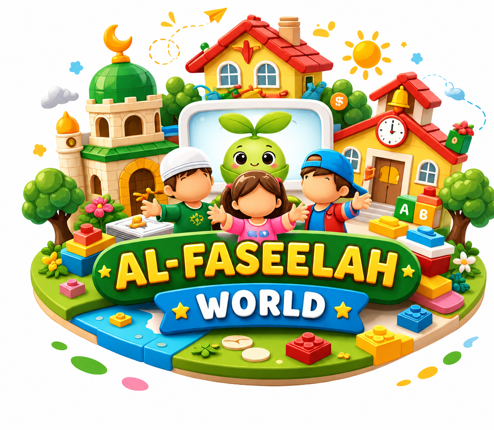

# 🌱 Al-Faseelah World | عالم الفسيلة

### An AI-Powered Interactive Educational Toy for Children

*Where physical play meets conversational intelligence — built on Raspberry Pi 5*

[](./Application)
[](./Hardware)
[](./AI)
[](#-system-architecture)
[]()

<br/>

**[Hardware](./Hardware) · [AI Engine](./AI) · [Pearant App](./Application) · [Documentation](./Documentation)**

</div>

---

## 📖 About the Project

**Al-Faseelah World** (عالم الفسيلة) is a graduation project reimagining the educational toy: a physical, tactile play set that *listens, understands, and responds*. A child places a piece on a themed board — **school**, **home**, **mosque**, or **zoo/careers** — and the toy recognizes it, speaks about it in character through its green sprout companion, and reacts with a matching facial expression, all within a few seconds.

Meanwhile, the **Pearant** companion mobile app lets parents follow along: which child is playing, what they've learned, and what they've achieved.

> Built as a graduation project for the Electrical and Computer Engineering Department, Birzeit University.

---

## 🧩 System Architecture — Three Layers

<div align="center">

```
        🧒 Child places a piece on a board
                      │
                      ▼
        ┌─────────────────────────────┐
        │   1️⃣  HARDWARE LAYER         │
        │   Reed switches + GPIO       │
        │   on Raspberry Pi 5          │
        └───────────────┬─────────────┘
                         ▼
        ┌─────────────────────────────┐
        │   2️⃣  AI ENGINE LAYER        │
        │   Persona · Content Manager  │
        │   Whisper (STT) → Gemini     │
        │   → Voice + Pygame Face      │
        └───────────────┬─────────────┘
                         ▼
        ┌─────────────────────────────┐
        │   3️⃣  APPLICATION LAYER      │
        │   Pearant (Flutter)          │
        │   RFID login · Achievements  │
        │   Supabase (shared backend)  │
        └─────────────────────────────┘
```

</div>

### 1️⃣ Hardware Layer — [`/Hardware`](./Hardware)
The physical foundation. A grid of reed switch sensors wired zone-by-zone (school, home, mosque, and a shared zoo/careers board) into a Raspberry Pi 5's GPIO pins, with dynamic dual-zone mapping so the same pins can serve two boards.

<div align="center">
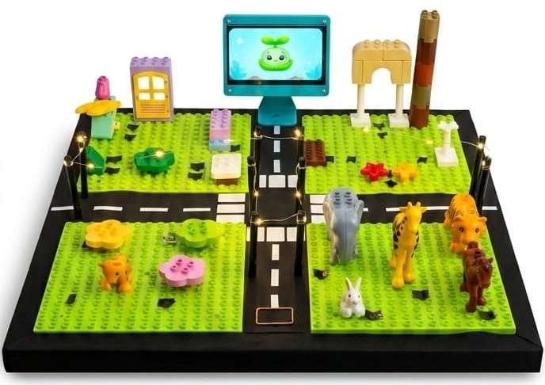
</div>

### 2️⃣ AI Engine Layer — [`/AI`](./AI)
The brain and voice. A **Persona Module** shapes how the toy "speaks," a **Content Manager** pulls the right content for each piece, and a full voice pipeline — **Whisper** for speech-to-text and **Gemini** for response generation — completes a full interaction cycle in roughly **2–3.5 seconds**, paired with **Pygame**-rendered facial expressions.

### 3️⃣ Application Layer — [`/Application`](./Application)
The parent's window in. A **Flutter** app called **Pearant**, with RFID-based child identification, a live content library, an achievements screen, per-child preferences, and RLS-secured saved content — all synced through a shared **Supabase** backend.

---

## ✨ Features

| | Feature | Description |
|---|---|---|
| 🧠 | **Conversational AI Companion** | Persona-driven responses with real-time facial expressions |
| 🗺️ | **Multiple Learning Zones** | School, home, mosque, and a dynamic zoo/careers board |
| 🎙️ | **Fast Voice Interaction** | ~2–3.5s full cycle: listen → think → respond |
| 🪪 | **RFID Child Recognition** | The app knows exactly who's playing |
| 🏆 | **Achievements & Progress** | Kids unlock achievements; parents track progress |
| ⚙️ | **Live, Synced Content** | One Supabase backend drives both the toy and the app |
| 🔒 | **Secured Per-Child Data** | Row-Level Security on saved content and preferences |

---

## 📱 App Preview — Pearant

<div align="center">

### Onboarding & Child Profiles
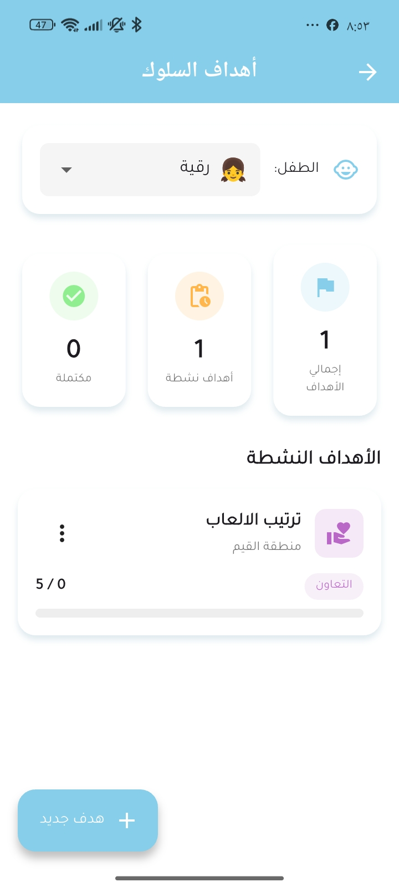 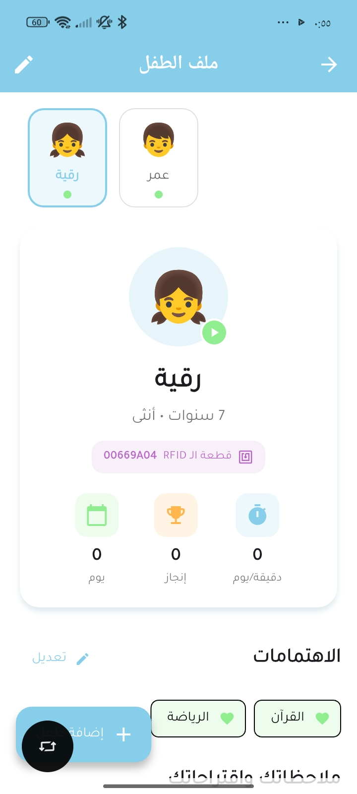 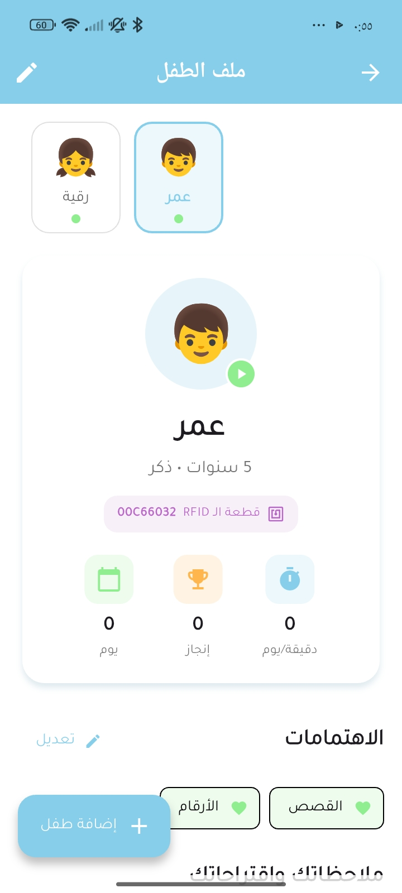 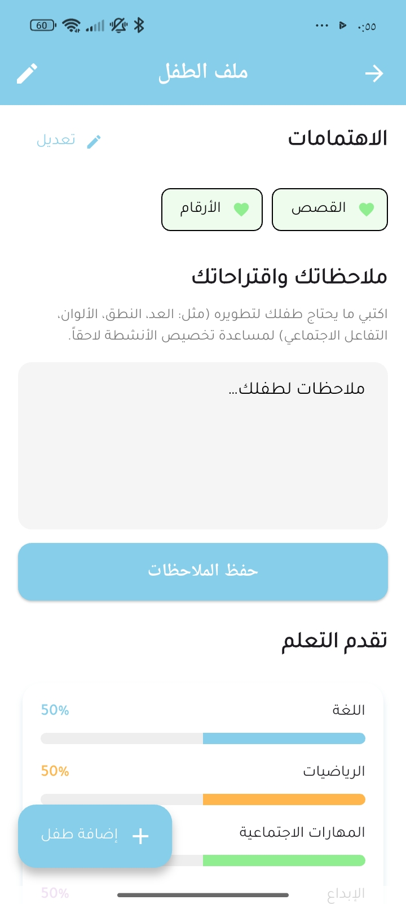

### Home & Board Selection
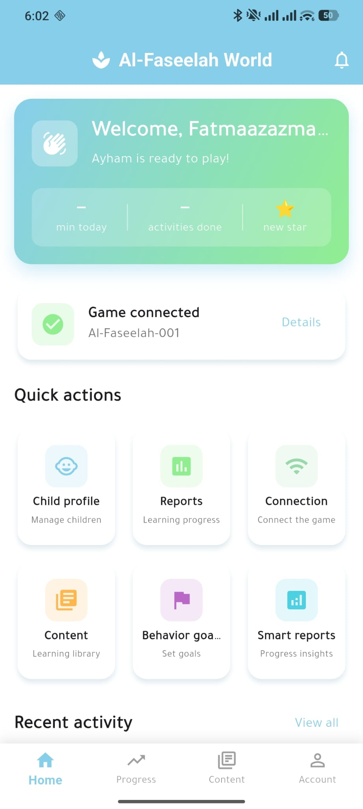 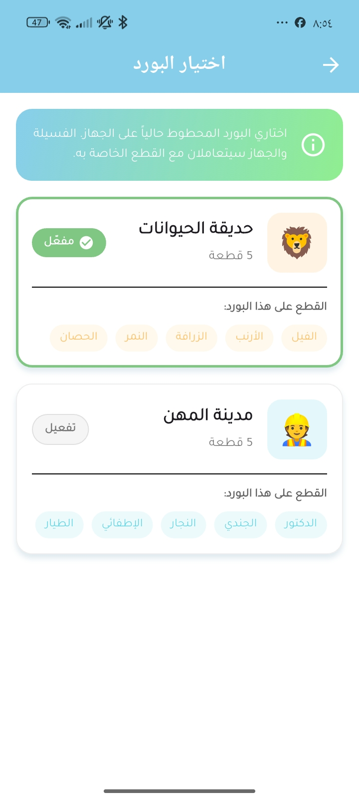

### Content Library
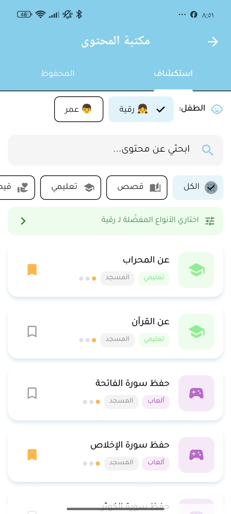 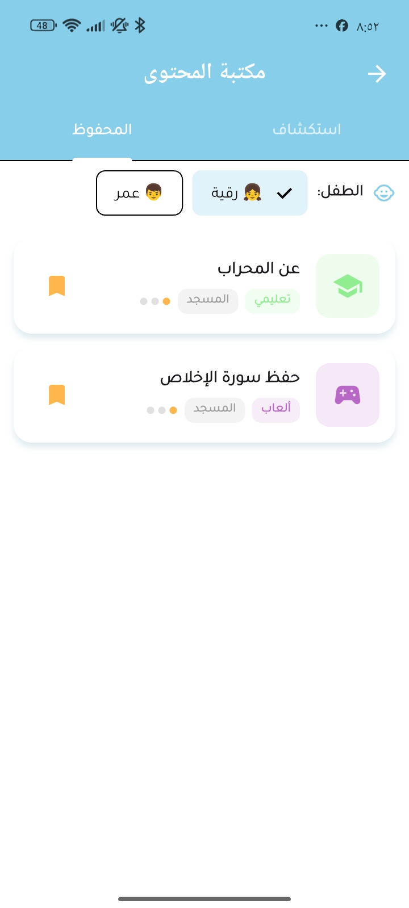 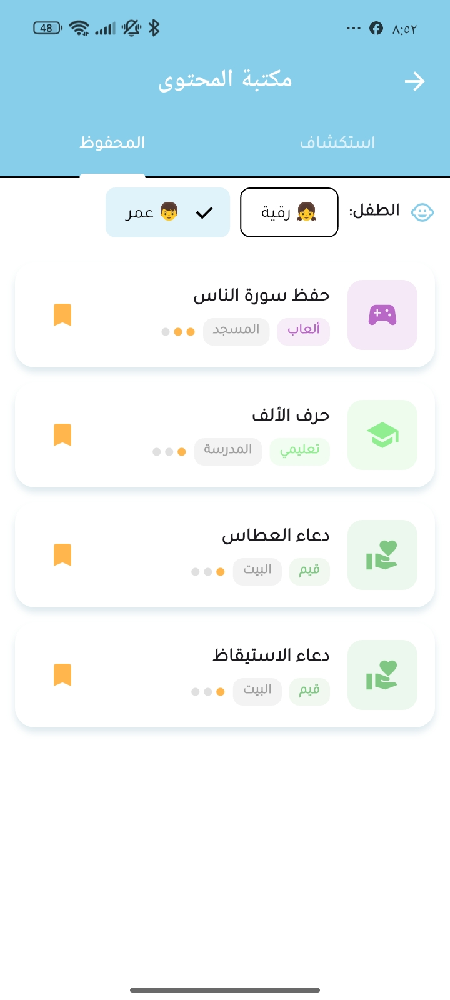 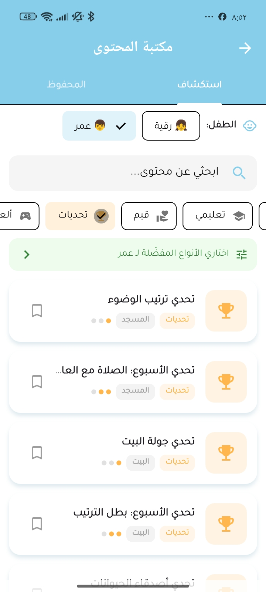

### Achievements & Progress
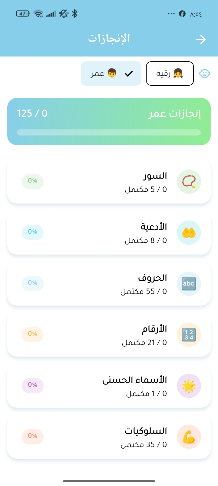 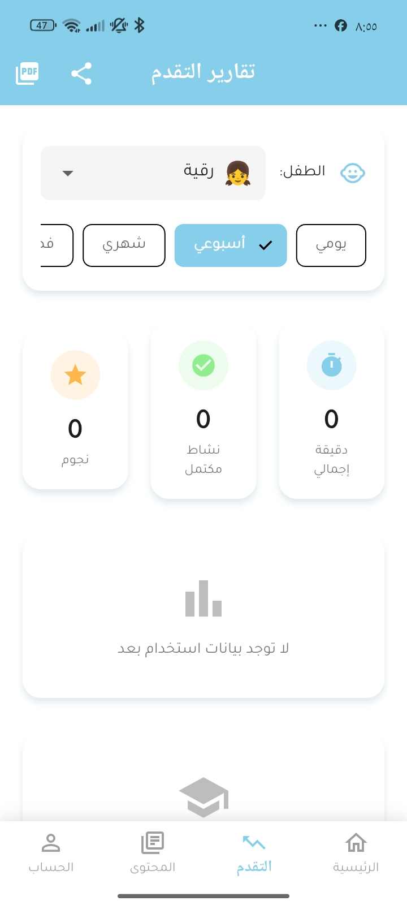 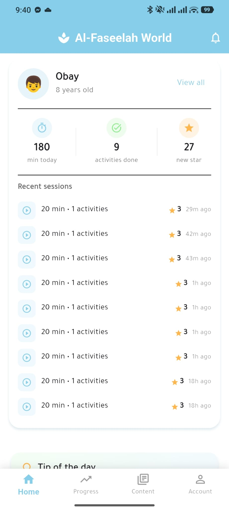

### Reports & Settings
 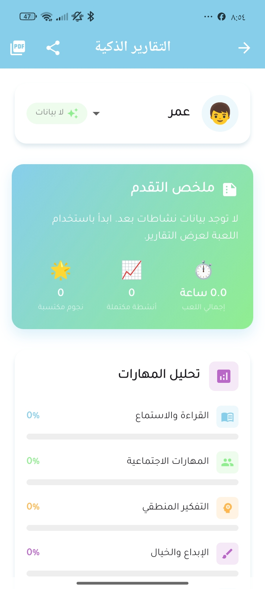 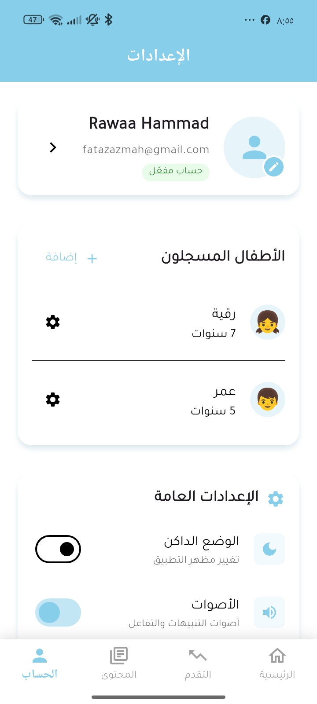

</div>

---

## 🛠️ Tech Stack

`Python` · `Raspberry Pi 5 (GPIO)` · `Flutter` · `Dart` · `Supabase (PostgreSQL)` · `OpenAI Whisper` · `Google Gemini` · `Pygame`

---

## 📂 Repository Structure

```
Al-Faseelah-World-Project/
├── Hardware/         # Sensors, GPIO mapping, wiring
├── AI/                # Persona, content manager, voice pipeline
├── Application/       # Pearant — Flutter parent app
│   └── app-Images/     # App screenshots used in this README
├── Documentation/      # Report, diagrams, design docs
├── assets/             # Cover, logo, toy photos
└── README.md
```

---

## 👥 Team

<div align="center">

| Photo | Name | Role |
|:---:|:---:|:---:|
| 🧑‍💻 | **Rawaa** | *[role — e.g. AI & Hardware Integration]* |
| 🧑‍💻 | *[teammate name]* | *[role]* |
| 🧑‍🏫 | *[supervisor name]* | *Project Supervisor* |

</div>

> Electrical and Computer Engineering Department, Birzeit University

---

<div align="center">

*Made with 🌱 by the Al-Faseelah World team*

</div>
